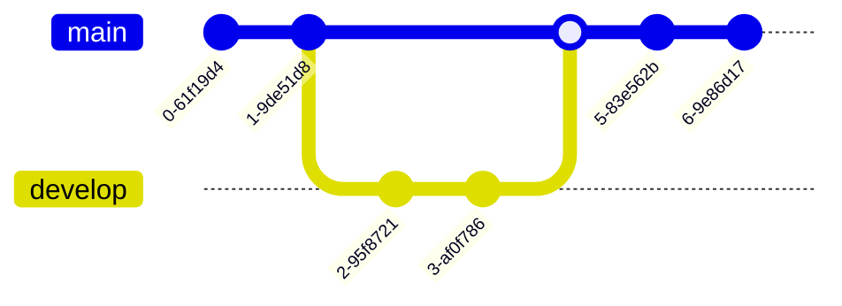

# userstories

# US 001, JavaScript

### This is a way of writing a JS code block:

```js
function jsblock(){
alert("This is a js-code block")
}
```
---

# US 010, Lists

### This is an ordered list

1. It's numbered
2. From 1..
3. etc etc


### This is an unordered list

* It's not
* numbered
* Instead we use
* an asterix. 


### We can of course also create a task list:

- [x] Learn stuff
- [ ] Learn more stuff
- [ ] Get a job

---

# US 002, Java
```java
lass HelloWorld {
    public static void main(String[] args) {
        System.out.println("Hello, World!"); 
    }
}
`````
---

# US 003, Insert image
> For inserting an image through its link we can write the the link of the image in parentheses.

---

# US 004, JS
> For writing javascript code block in markdown we need to use three backtick and the writng the javascript name front of that without any space and write done the code and close and finish it with 3 backtick again. Here we have the example:
> ```javascript ..... ```

---

# US 005, Links

### The easiest way to create a link is simply by putting the url in <>:
```
> <https://github.com/Petra-Johansson/userstories>

==and the result will be this:==
```
> <https://github.com/Petra-Johansson/userstories>


### If you want to, you can also add a Title to your link:
```
> [Link to Repo](https://github.com/petra-johansson/userstories "This is a likn with a title")


and the result will be this:
```
> [Link to Repo](https://github.com/Petra-Johansson/userstories "This is a link with a title")

### You can also create reference links:
```
[Ref to repo-link][1]
[1]: <https://github.com/Petra-Johansson/userstories>

```

---

# US 003, Insert image
> For inserting an image that is in your repo.
---


---

---

# US 006, Tables

### To create a table we do like this:

```
 | Header       | Header        | Header        |
 |:---          |:----------:   | ----------:   |
 |Stuff aligned | Stuff aligned | Stuff aligned |
 |to the left   | in center     | to the right  |
```
*and this is the result:*

> | Header       | Header        | Header        |
> | :----        | :--------:    | -----:        |
> |Stuff aligned | Stuff aligned | Stuff aligned |
> |to the left   | in the center | to the right  |
---

# US 007, Bold and Italic
For italic we can use underline or * in the beginig and the end of the text that we want to italic it.
We can write _like that_ or *that*
*italic text*

For bold we can use 2 underlines or * in the  beginig and the end of the text that we want to bold it.
We can write __like that_ or **that**
__bold text__
---

# US 008, Emoticon
For using emoticons can use : and then write the emoticon fron of that. :happy  :smiley
:smiley:
---
# 009, Horisontal Ruler
* * *

***

*****

- - -

---------------------------------------
# US 010

*This is a ordered list*
```
> 1. It's numbered
> 2. From 1..
> 3. etc etc
```
*This is an unordered list*
```
> - It's not
> - numbered
> * but still
> * a list 
> - :joy:
```
___
# US 011, Blockqoutes
> Dorothy followed her through many of the beautiful rooms in her castle.
>
> The Witch bade her clean the pots and kettles and sweep the floor and keep the fire fed with wood.
---
# US 012, Making a ER-diagram, using mermai

---
# US 013, Class diagram using Mermaid

---
# US 014, 
```

```
---
# US 015, Higlight certain words in Markdown
```html
For marking words in highlighted text ==Highlighted text==. and so on
<span style="background-color: #FFFF00"> Very importent words</span>.
```
---
# US 016, Making a sequence diagram in Markdown using Mermaid.

---
# US 017, Making a Git Graph in Markdown using Mermaid.


---

# US 14, Making Headings
´to make headings we use #for h1 and up to ###### for h6´
# Heading 1
## Heading 2
### Heading 3
#### Heading 4
##### Heading 5
###### Heading 6

# US 18, Making a strikethrough text
`~~This text~~is strikethrugh and the result is this:  `

~~This text~~ is strikethrough

# US 19, Making inline codelblock
`to make an inline block we use backticks`
`<p>This is a paragraph</p>`

# US 20, Making tasks list
`for task list we use asterisk * and [x] for checked or [] for unchecked task`

* [x] Task 1
* [x] Task 2
* [ ] Task 3

# US 21 (extra), Making a toogle button
`this is the syntax for toogle
```toogle syntax
<details>
	<summary>This is a toogle!</summary>
</details>
```

`this is the result`

<details>
    <summary>This is a toogle!</summary>
    Content of toogle.
</details>
